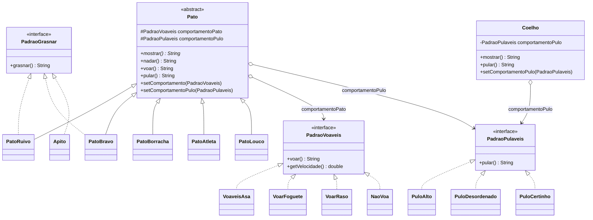
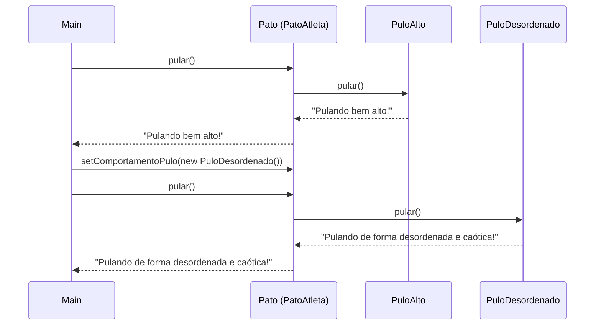

# Jogo dos Patos — Padrão Strategy

Implementação em Java da clássica simulação de patos do livro
*Head First Design Patterns*, estendida com um comportamento de pulo e com a
classe `Coelho`, que reaproveita o mesmo mecanismo de pulo por composição em
vez de herança.

O código é a entrega de um exercício de POO (Profa. Andréia D. Leles)
abordando: classes abstratas, herança, polimorfismo, interfaces, composição,
delegação e programação voltada a interface.

## Compilar e executar

Sem ferramenta de build — apenas `javac`/`java` com JDK 23+.

```bash
javac -d bin $(find src -name "*.java")
java -cp bin engsoft.jogo.patos.Main
```

## Estrutura de pacotes

```
engsoft.jogo.patos                       Main (ponto de entrada) + Coelho
engsoft.jogo.patos.pato                  Pato abstrato + patos concretos
engsoft.jogo.patos.comportamento.voar    Estratégia de voo + implementações
engsoft.jogo.patos.comportamento.grasnar Estratégia de grasno + implementações
engsoft.jogo.patos.comportamento.pular   Estratégia de pulo + implementações
```

## Arquitetura

O padrão Strategy desacopla *o que um pato faz* de *como ele faz*. As
responsabilidades de voar e pular são extraídas para interfaces
(`PadraoVoaveis`, `PadraoPulaveis`) com várias implementações, e `Pato`
mantém referências a elas como atributos. Os patos concretos plugam as
estratégias em seus construtores; os setters permitem trocá-las em tempo
de execução.

`PadraoGrasnar` é implementada diretamente pelos patos que grasnam — ela
*não* é uma estratégia mantida por `Pato`, então patos que não grasnam
(`PatoBorracha`) simplesmente não a implementam. `Apito` implementa a
mesma interface para mostrar que o contrato não está atrelado à hierarquia
de patos.

`Coelho` **não** estende `Pato`. Ele possui um campo `PadraoPulaveis` e
delega `pular()` a esse objeto, reutilizando exatamente as mesmas
estratégias de pulo que os patos usam. Esse é o argumento central de
composição sobre herança: reaproveitar comportamento não exige um
supertipo comum.

## Diagrama de classes



## Delegação em tempo de execução

Chamar `pato.voar()` não executa lógica de voo dentro de `Pato`. A chamada
é repassada para a instância de `PadraoVoaveis` que estiver atualmente em
`comportamentoPato`. A mesma indireção vale para o pulo. É essa indireção
que torna possível a troca de comportamento em tempo de execução.



## O que foi feito

O exercício tem três partes. O repositório original já trazia a Parte A; as
Partes B e C foram adicionadas em cima dela.

### Parte A — hierarquia base

`Pato` abstrato com patos concretos (`PatoRuivo`, `PatoBravo`,
`PatoBorracha`), a estratégia `PadraoVoaveis` com quatro implementações e
`PadraoGrasnar` implementada pelos patos que grasnam e por `Apito`.

### Parte B — comportamento de pular

- **Interface:** `PadraoPulaveis` com `String pular()`.
- **Estratégias:** `PuloAlto`, `PuloDesordenado`.
- **Patos concretos:** `PatoAtleta` (usa `PuloAlto`) e `PatoLouco` (usa
  `PuloDesordenado`).
- **Modificação em `Pato`:** atributo `comportamentoPulo`, setter
  `setComportamentoPulo()` e método `pular()` que delega. Nenhuma outra
  classe existente foi alterada — adicionar novos estilos de pulo só exige
  novas implementações de `PadraoPulaveis` (princípio Aberto/Fechado).

### Parte C — Coelho via composição

`Coelho` fica em `engsoft.jogo.patos`, não estende `Pato` e possui um
`PadraoPulaveis`. Por padrão usa a estratégia `PuloCertinho`; o setter
permite trocar em tempo de execução para qualquer estratégia existente —
no demo a troca é para `PuloAlto`.

## Boas práticas aplicadas no código

- Classes-folha (estratégias e patos concretos) marcadas como `final` para
  desencorajar herança não planejada.
- Parâmetros de método/construtor marcados como `final`.
- Números mágicos das velocidades extraídos para constantes
  `private static final` (ex.: `VELOCIDADE` em cada estratégia de voo).
- Javadoc com `@param` e `@return` em métodos públicos das interfaces e
  classes principais.
- Compilação limpa com `javac -Xlint:all` (sem avisos).
- Construtor privado em `Main` para sinalizar classe utilitária não
  instanciável.

## Saída da execução

Ao executar `Main`, a saída é:

```
Eu sou o Pato Ruivo.
Pato Nadando.
Voando como um pássaro. Velocidade: 10.0
Voando como um foguete. Velocidade: 1000.0
Voando perto do chão. Velocidade: 100.0

===== PARTE B - COMPORTAMENTO DE PULAR =====
Eu sou o Pato Atleta.
Pulando bem alto!
Eu sou o Pato Louco.
Pulando de forma desordenada e caótica!

--- Pato Atleta trocando de comportamento ---
Eu sou o Pato Atleta.
Pulando de forma desordenada e caótica!

===== PARTE C - COELHO PULA =====
Eu sou um Coelho!
Pulando certinho.
Coelho trocou de comportamento:
Pulando bem alto!
```
